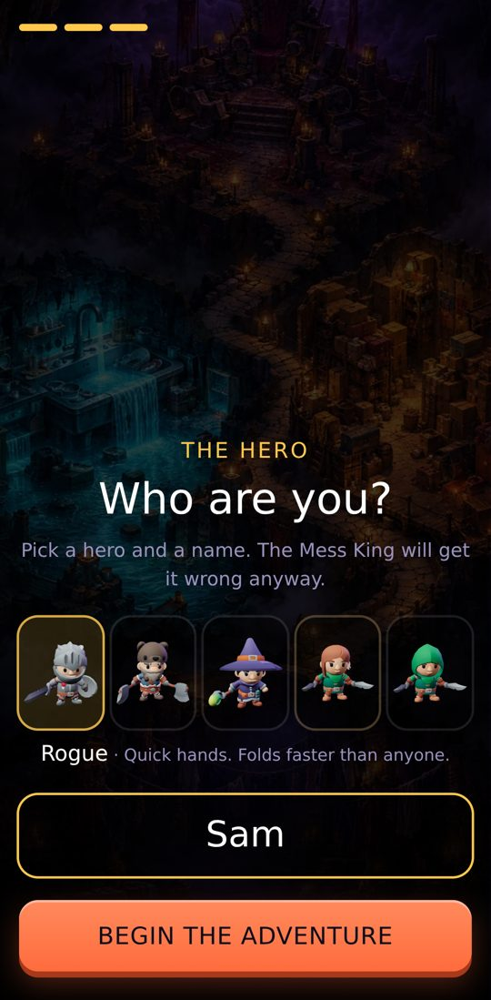
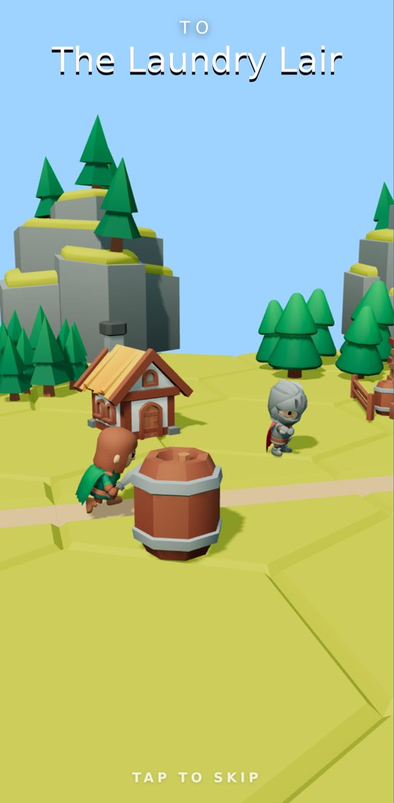
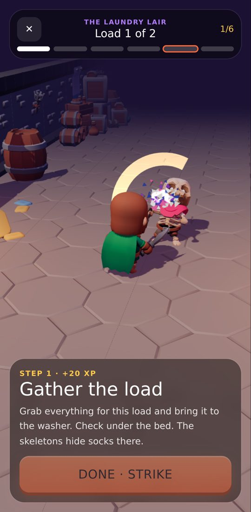
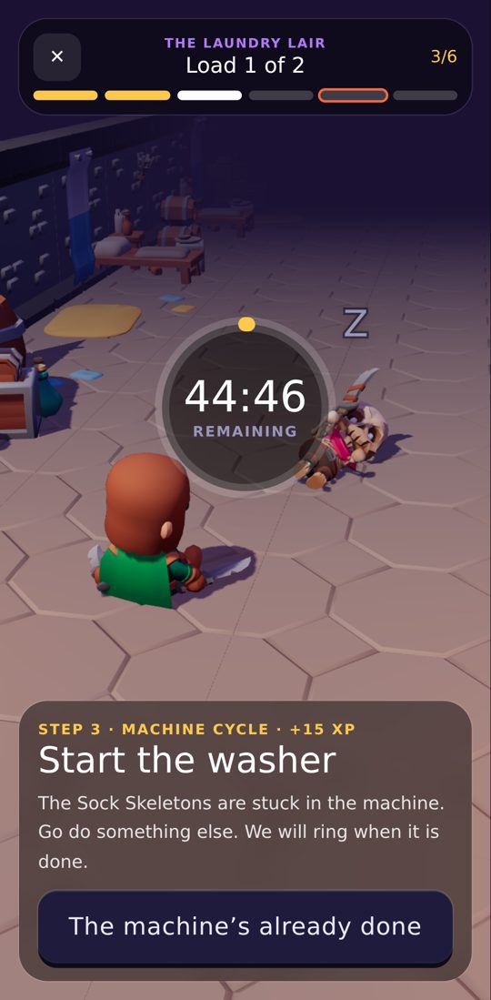
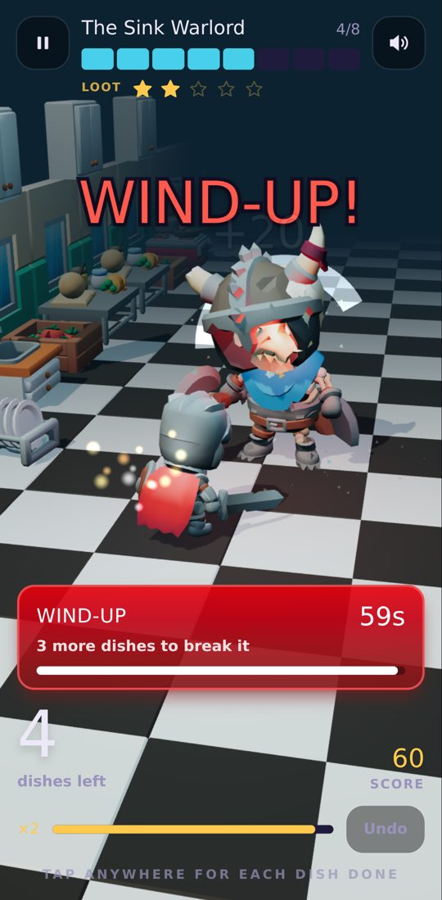

# Chore Raid

> Your home is a dungeon. Each chore is a boss made of the actual mess.
> You damage it by doing the real work, one item at a time.

**Play it:** https://choreraid.netlify.app (made for phones; works on desktop with Space/Enter)

Built for the Hackyard build week (theme: **Gamification**), Oct 5–9, 2026.

<p>
  
  
  
  
  
  
</p>

## The idea

Most chore apps gamify the *list*: you tick a box and get a sticker. Chore Raid gamifies the *work itself*, while you are doing it, and it walks you through the chore step by step.

**The story:** one evening the Mess King moved into your home. You, the hero (pick one of five, any name, any age), win the house back, one lair at a time.

**The campaign:** a painted world map with three lairs and a throne room, each reached by walking through the village.

- **The Laundry Lair:** one level per load; the Laundry Lich waits in the last load.
- **The Sink Caverns:** one level per sinkful; the Sink Warlord guards the last.
- **The Clutter Keep:** one level per room you pick; the Clutter Colossus holds the last room.
- **The Mess King's Throne:** opens once all three bosses fall. A whole-home reset is the final battle.

**Every level is the real chore, step by step.** Laundry is *Gather → Sort → Start the washer (timer) → Dryer (timer) → Fold (boss fight) → Put it away (finishing blow)*. The game reads each step aloud, quick steps are one-tap minion skirmishes, washer and dryer cycles are timers that ring when the machine is done, and the counting step is the fight: one finished item, one hit.

**Progression:** XP for every step, hero levels, weapons that unlock along the way (Frostbristle, Emberbroom, the Royal Mop), a daily bounty with 2× XP, a streak, loot chests, a trophy room, and a shareable before/after win card.

**Quick raid** is still there for one-off chores, including custom bosses for anything countable.

## The one rule: HP is sacred

**1 hit = 1 real item.** Nothing in the game can kill the boss before the chore is actually finished. Combos, crits and boss heals all exist, but they change your **score** and your **loot**, never the HP. That is what keeps the game honest: you can't win without doing the chore.

## Game mechanics

- **Combos:** keep hitting within 20 seconds to climb ×2 → ×3 → ×4. The hit sound rises in pitch as the streak builds.
- **Boss wind-ups:** every 25–35% of the pile, the boss winds up and demands up to 3 items within 20 seconds each. Beat it for a CRITICAL, bonus score and a Loot Star. Miss it and the boss smugly heals its Ward (you lose a Loot Star, never progress).
- **Loot Stars → loot rarity:** 0–5 stars shift the odds of a common, rare, epic or legendary trophy from the chest.
- **Undo:** a mis-tap is one button away, so the count stays honest.
- **Trophy room:** 24 trophies to collect, with locked ones shown as silhouettes, plus your raid history.
- **Custom bosses:** "Summon a boss" turns any countable chore (plants, emails, bills) into a Mess Elemental.

## Built to be played without looking

Your eyes are on the laundry, not the phone, so the game is audio-first:

- **A real narrator:** every line is pre-recorded by a British storyteller voice, not the phone's robotic one. Spoken progress, deadpan as ever: "Halfway. 10 dishes left." "The Hydra regrows a head. 3 dishes in 60 seconds."
- **Synthesized sound effects** for every hit, combo, wind-up tick, crit, heal, heartbeat at low HP and death.
- **Haptics** on hits (Android).
- **Optional voice hits:** say "hit", "done" or "next" instead of tapping. The mic pauses while the game is talking, so it never hears itself.
- **Screen stays awake** during a raid (Wake Lock API, with a tip where it isn't supported).
- **Resume after reload:** a locked phone or an accidental swipe never loses a 40-item pile.

## A real adventure, not a counter

Your hands are full of laundry, so the input is one tap (or one word), but every tap is a real attack in a 3D action scene (three.js, WebGL) with rigged, animated characters:

- **Pick your hero:** Knight, Barbarian, Mage, Rogue or Ranger. Each fights differently: sword and shield, twin axes, spells from range, twin daggers.
- **Walk to the lair.** Starting a quest plays a short run through the village, past cheering villagers, to the lair gate.
- **Fight your way down the hall.** Each lair (a dungeon basement, a kitchen, a cluttered house, a throne room) is a long hall, and every step of the chore is fought a little deeper in. Minions claw their way out of the floor; bosses march in and roar.
- **Every item is a real attack.** The hero dashes in and swings (slash, chop, cleave, stab, cycling), the enemy staggers back, with hit-stop, sparks, debris and screen shake. Combos unlock specials: at ×3, lightning; at ×4, slow-motion crits.
- **The enemy fights back, for real.** Every few seconds of dawdling it charges a blow: a red INCOMING warning with a countdown, read aloud. Finish the next item (or the step) before it lands and your hero strikes first, interrupting it for bonus score. Too slow and the blow lands on *your* health, which carries through the whole level. Hit zero and you're knocked down: you lose a Loot Star and get back up. Take no blows in a level or fight for a **FLAWLESS** bonus. Machine cycles are safe, but when the washer finishes the skeleton wakes up and comes for you, so go back to the machine. (Your health is the stake, never the chore: the enemy's HP still only moves when real items are done.)
- **Wind-ups are charge attacks.** Finish the items in time to **PARRY** for a critical; miss and the boss heals its Ward and swings.
- **Bosses break apart as you work.** Shields, helmets and hats fly off as HP drops; the last item is a leaping finisher, and the boss collapses into a pile of bones.
- **Machine cycles are rest breaks.** Start the washer and the hero sits down while the minion naps until the timer rings.

## How AI was used

- **Code:** written with Claude Code (Anthropic) during the build window, from a plan we wrote together ([PLAN.md](PLAN.md)). I made the design calls (the HP-is-sacred rule, the deadpan tone, the art direction); Claude implemented, tested and iterated.
- **Art:** the painted story panels, world map and lair backdrops were generated with **Bloom** from our own art-direction brief ([docs/ART_DIRECTION.md](docs/ART_DIRECTION.md)). The 3D characters, animations, dungeon, kitchen, furniture and village pieces are the free **KayKit** packs by Kay Lousberg (CC0), trimmed for the web by [tools/models.mjs](tools/models.mjs); menu portraits are renders of those models ([tools/portraits.cjs](tools/portraits.cjs)).
- **Voice:** the narrator is recorded ahead of time with **Kokoro**, an open-weights text-to-speech model (Apache 2.0), one clip per sentence ([tools/narrate.py](tools/narrate.py)). A test checks that every line the game can say has a recording. Sound effects are synthesized in code with the Web Audio API (no audio files).

## Tech

- Vite + React 19 + TypeScript, Tailwind CSS v4, Motion for UI animation
- three.js for the 3D scenes (one shared WebGL context, static scenery merged into a few draw calls, automatic lower quality on slow phones)
- Web Audio API (synthesized SFX), Web Speech API (voice hits, and a fallback voice for custom bosses), Wake Lock API, Vibration API
- IndexedDB for everything (raids, photos, loot). **No backend, no account:** your photos never leave your phone.
- Vitest for the game logic: the raid reducer is pure and tested, including the HP rule, combos, wind-ups and loot odds.
- Hosted on Netlify

## Run it locally

```sh
npm install
npm run dev     # http://localhost:5173
npm test        # game logic tests
npm run build   # production build in dist/
```

## License

[MIT](LICENSE)
