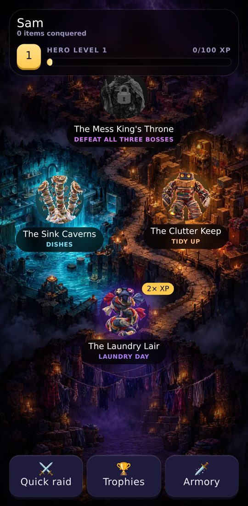
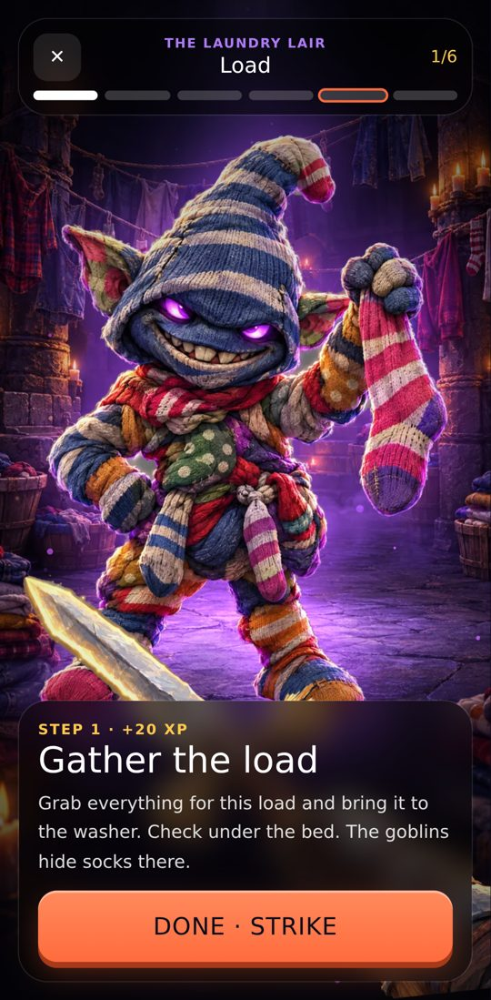
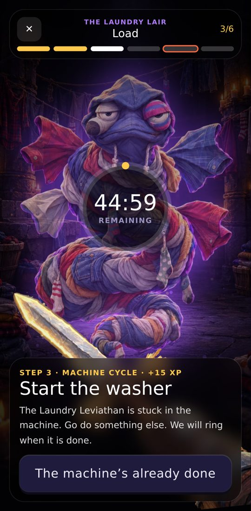
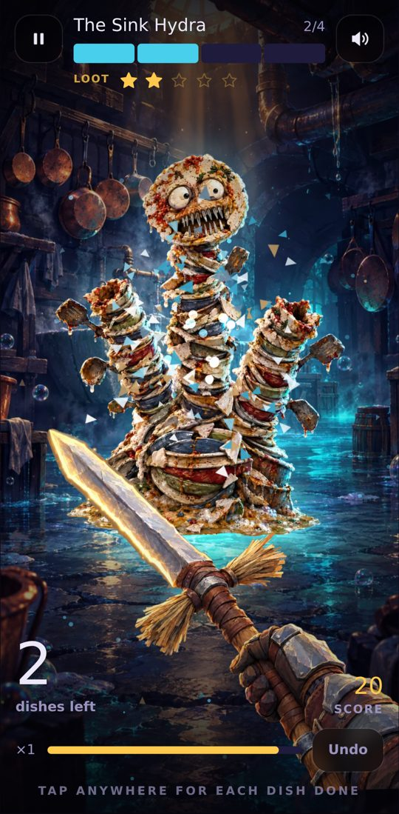
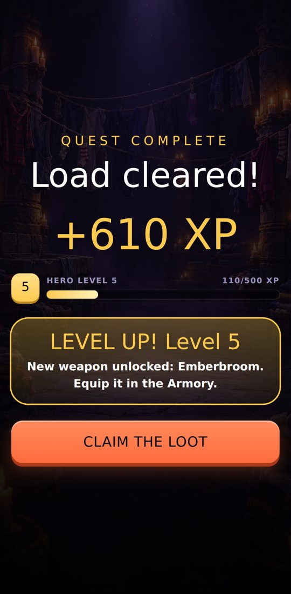
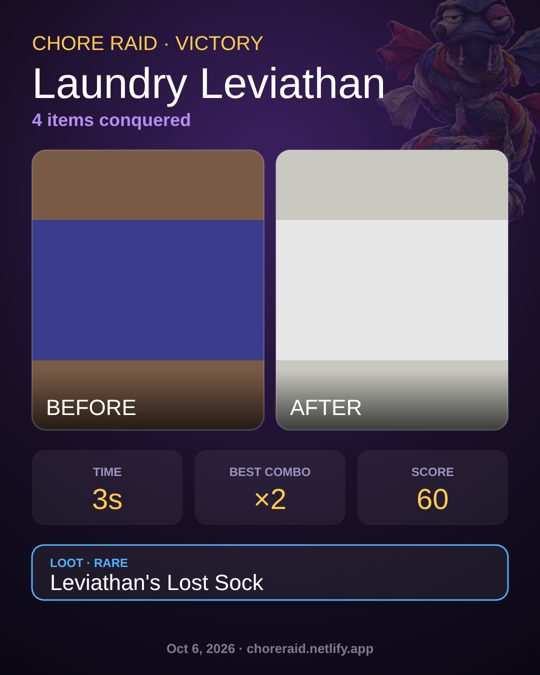

# Chore Raid

> Your home is a dungeon. Each chore is a boss made of the actual mess.
> You damage it by doing the real work, one item at a time.

**Play it:** https://choreraid.netlify.app (made for phones; works on desktop with Space/Enter)

Built for the Hackyard build week (theme: **Gamification**), Oct 5–9, 2026.

<p>
  
  
  
  
  
  
</p>

## The idea

Most chore apps gamify the *list*: you tick a box and get a sticker. Chore Raid gamifies the *work itself*, while you are doing it, and it walks you through the chore step by step.

**The story:** one evening the Mess King moved into your home. You, the hero (any name, anyone, any age), pull the Broomblade out of the hall closet and win the house back, one lair at a time.

**The campaign:** a painted world map with three lairs and a throne room.

- **The Laundry Lair:** one level per load; the Laundry Leviathan waits in the last load.
- **The Sink Caverns:** one level per sinkful; the Sink Hydra guards the last.
- **The Clutter Keep:** one level per room you pick; the Clutter Golem holds the last room.
- **The Mess King's Throne:** opens once all three bosses fall. A whole-home reset is the final battle.

**Every level is the real chore, step by step.** Laundry is *Gather → Sort → Start the washer (timer) → Dryer (timer) → Fold (boss fight) → Put it away (finishing blow)*. The game reads each step aloud, quick steps are one-tap minion skirmishes, washer and dryer cycles are timers that ring when the machine is done, and the counting step is the fight: one finished item, one hit.

**Progression:** XP for every step, hero levels, weapons that unlock along the way (Frostbristle, Emberbroom, the Royal Mop), a daily bounty with 2× XP, a streak, loot chests, a trophy room, and a shareable before/after win card.

**Quick raid** is still there for one-off chores, including custom bosses for anything countable.

## The one rule: HP is sacred

**1 hit = 1 real item.** Nothing in the game can kill the boss before the chore is actually finished. Combos, crits and boss heals all exist, but they change your **score** and your **loot**, never the HP. That is what keeps the game honest: you can't win without doing the chore.

## Game mechanics

- **Combos:** keep hitting within 20 seconds to climb ×2 → ×3 → ×4. The hit sound rises in pitch as the streak builds.
- **Boss wind-ups:** every 25–35% of the pile, the boss winds up and demands up to 3 items within 20 seconds each. Beat it for a CRITICAL, bonus score and a Loot Star. Miss it and the boss smugly heals its Ward (you lose a Loot Star, never progress).
- **Loot Stars → loot rarity:** 0–5 stars shift the odds of a common, rare, epic or legendary trophy from the chest.
- **Undo:** a mis-tap is one button away, so the count stays honest.
- **Trophy room:** 24 trophies to collect, with locked ones shown as silhouettes, plus your raid history.
- **Custom bosses:** "Summon a boss" turns any countable chore (plants, emails, bills) into a Mess Elemental.

## Built to be played without looking

Your eyes are on the laundry, not the phone, so the game is audio-first:

- **Spoken progress** in a deadpan boss voice: "Halfway. 10 dishes left." "The Hydra regrows a head. 3 dishes in 60 seconds."
- **Synthesized sound effects** for every hit, combo, wind-up tick, crit, heal, heartbeat at low HP and death.
- **Haptics** on hits (Android).
- **Optional voice hits:** say "hit", "done" or "next" instead of tapping. The mic pauses while the game is talking, so it never hears itself.
- **Screen stays awake** during a raid (Wake Lock API, with a tip where it isn't supported).
- **Resume after reload:** a locked phone or an accidental swipe never loses a 40-item pile.

## A real fight, not a counter

Your hands are full of laundry, so the input is one tap (or one word), but every tap is a real attack in a first-person fight (PixiJS, WebGL):

- **Your weapon, the Broomblade,** swings in first person: slash, backslash, thrust, overhead smash, cycling so no two hits in a row look the same. Each strike leaves a slash trail across the boss, with hit-stop, flash, screen shake and debris made of the boss's own material.
- **Combos unlock specials:** at ×3, lightning strikes the boss; at ×4, an ultimate X-slash in slow motion.
- **The boss fights back.** Stall for too long and it lunges at you: the screen shakes, claw marks rake across it, and your phone buzzes. Hit back right after for a **COUNTER**. (It's all cosmetic: HP never changes except by finishing items.)
- **Wind-ups are boss charge attacks.** Finish the items in time to **PARRY** for a critical; miss and it lands the blow and heals its Ward.
- **The boss breaks apart as you work:** each boss has damage stages, and the last item triggers a **finisher**: a spinning double slash, then the boss shatters.

## How AI was used

- **Code:** written with Claude Code (Anthropic) during the build window, from a plan we wrote together ([PLAN.md](PLAN.md)). I made the design calls (the HP-is-sacred rule, the deadpan tone, the art direction); Claude implemented, tested and iterated.
- **Art:** the painted boss art was generated with **Bloom** from our own art-direction brief ([docs/ART_DIRECTION.md](docs/ART_DIRECTION.md)), then cut out into game sprites with a small script ([tools/cutout.py](tools/cutout.py)).
- **Audio and voice:** no AI audio. Sound effects are synthesized in code with the Web Audio API, and speech uses the browser's built-in text-to-speech.

## Tech

- Vite + React 19 + TypeScript, Tailwind CSS v4, Motion for UI animation
- PixiJS 8 for the raid scene
- Web Audio API (synthesized SFX), Web Speech API (speech + voice hits), Wake Lock API, Vibration API
- IndexedDB for everything (raids, photos, loot). **No backend, no account:** your photos never leave your phone.
- Vitest for the game logic: the raid reducer is pure and tested, including the HP rule, combos, wind-ups and loot odds.
- Hosted on Netlify

## Run it locally

```sh
npm install
npm run dev     # http://localhost:5173
npm test        # game logic tests
npm run build   # production build in dist/
```

## License

[MIT](LICENSE)
